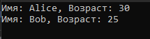

# c# Рефакторинг кода

Проект на языке с# с использованием классов, членов классов, которые выводят информацию записанную в переменные класса.

## Начало работы

Эти инструкции предоставят вам копию проекта и помогут запустить на вашем локальном компьютере для разработки и тестирования.

### Необходимые условия

Что нужно для установки программного обеспечения и как его установить

Установить <a href = "https://visualstudio.microsoft.com/ru/vs/community/">Microsoft VS 2022</a> с компонентами c#

### Установка
Вариант 1. 
```
Создать новый проект C# в Visual Studio
```
```
Скопировать и вставить код из файла Program.cs в файл Program.cs.
```
```
Запустить проект, чтобы увидеть результат.
```

Вариант 2.
1. Склонировать репозиторий
```
git init
```
```
git clone https://github.com/sedypana/c-_refactoring.git
```
Запустить проект
```
Запустить файл ConsoleApp2.sln
```
```
Нажать на кнопку "Пуск"
```


## Авторы

<h3 align="center">


<h3>
